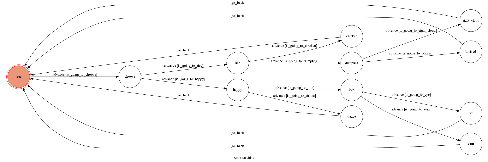

# 計算理論 Project 2019    


A Line bot based on a finite state machine

## Setup

### Prerequisite
* Python 3.6.7
* Pipenv
* Line developer
* Heroku
* Windows 10

#### Install Dependency
```sh
pip install -r requirements.txt
```

* pygraphviz (For visualizing Finite State Machine)
    * [Setup pygraphviz on Windows]
      Steps:
1. Download graphviz-2.38.msi from https://graphviz.gitlab.io/_pages/Download/Download_windows.html and install
2. Download the version of python you need from https://github.com/CristiFati/Prebuilt-Binaries/tree/master/PyGraphviz/v1.5/Graphviz-2.42.2
3. Navigate to the directory that you downloaded the wheel file to
4. Run pip install pygraphviz-1.3.1-cp27-none-win_amd64.whl
5. Rejoice
	


#### Secret Data
You should generate a `.env` file to set Environment Variables refer to our `.env.sample`.
`LINE_CHANNEL_SECRET` and `LINE_CHANNEL_ACCESS_TOKEN` **MUST** be set to proper values.
Otherwise, you might not be able to run your code.


#### Run the sever

```sh
python app.py
```


## Finite State Machine


## Usage
The initial state is set to `user`.

Every time `user` state is triggered to `advance` to another state, it will `go_back` to `user` state after the bot replies corresponding message.

* user
	* Input: "eat"
	    * State: choose
	    * Reply: 要吃長榮路的嗎? y/n?"
	      * Input: "y"
	          * State: happy
		  * Reply: "你今天開心嗎? y/n?"
		       * Input: "y"
		            * State: box
			    * Reply: "想吃便當類的嗎? y/n?
			         * Input: "y"
				      * State: eye
				      * Reply: "那就吃目白吧!有機會遇到認識的人喔!XD" (回到 user state)
				 * Input: "n"
				      * State: earn
				      * Reply: "吃吃吃...饌前!肉羹還不錯" (回到 user state)
		       * Input: "n"
		            * State: dumpling
			    * Reply: "想吃餃子嗎? y/n?"
			         * Input: "y"
				      * State: eight_cloud
				      * Reply: "吃八方雲集吧~前陣子新出的雞肉鍋貼還不錯" (回到 user state)
				 * Input: "n"
				      * State: dance
				      * Reply: "那去舞春好好吃一波吧!!對面甜點聽說不錯" (回到 user state)
			    
	    * Input: "n"
	       * State: rice
	       * Reply: "想吃飯類的嗎? y/n? "
	         
		       * Input: "y"
		            * State: chicken   
			    * Reply: "施家火雞肉飯~傍晚還有麻糬可以買  超好吃!!" (回到 user state)
		        * Input: "n"
		            * State: dumpling
			    * Reply: "想吃餃子嗎? y/n?"
			         * Input: "y"
				      * State: eight_cloud
				      * Reply: "吃八方雲集吧~前陣子新出的雞肉鍋貼還不錯" (回到 user state)
				 * Input: "n"
				      * State: dance
				      * Reply: "那去舞春好好吃一波吧!!對面甜點聽說不錯" (回到 user state)
			    

## Deploy
Setting to deploy webhooks on Heroku.

### Heroku CLI installation

* [macOS, Windows](https://devcenter.heroku.com/articles/heroku-cli)


### Connect to Heroku

1. Register Heroku: https://signup.heroku.com

2. Create Heroku project from website

3. CLI Login

	`heroku login`

### Upload project to Heroku

1. Add local project to Heroku project

	heroku git:remote -a {HEROKU_APP_NAME}

2. Upload project

	```
	git add .
	git commit -m "Add code"
	git push -f heroku master
	```

3. Set Environment - Line Messaging API Secret Keys

	```
	heroku config:set LINE_CHANNEL_SECRET=your_line_channel_secret
	heroku config:set LINE_CHANNEL_ACCESS_TOKEN=your_line_channel_access_token
	```

4. Your Project is now running on Heroku!

	url: `{HEROKU_APP_NAME}.herokuapp.com/callback`

	debug command: `heroku logs --tail --app {HEROKU_APP_NAME}`

5. If fail with `pygraphviz` install errors

	run commands below can solve the problems
	```
	heroku buildpacks:set heroku/python
	heroku buildpacks:add --index 1 heroku-community/apt
	```

	refference: https://hackmd.io/@ccw/B1Xw7E8kN?type=view#Q2-如何在-Heroku-使用-pygraphviz

## Reference
[Pipenv](https://medium.com/@chihsuan/pipenv-更簡單-更快速的-python-套件管理工具-135a47e504f4) ❤️ [@chihsuan](https://github.com/chihsuan)

[TOC-Project-2019](https://github.com/winonecheng/TOC-Project-2019) ❤️ [@winonecheng](https://github.com/winonecheng)
[TOCproject2020](https://github.com/NCKU-CCS/TOC-Project-2020)
Flask Architecture ❤️ [@Sirius207](https://github.com/Sirius207)

[Line line-bot-sdk-python](https://github.com/line/line-bot-sdk-python/tree/master/examples/flask-echo)
[Setup pygraphviz on Windows]https://stackoverflow.com/questions/40809758/howto-install-pygraphviz-on-windows-10-64bit/42059133?fbclid=IwAR3t8ZuzDLIous-i26_gYWEv2Wz-T1RgO2ykTKk7PvmxVvwt-GJ5NnhIj9c
